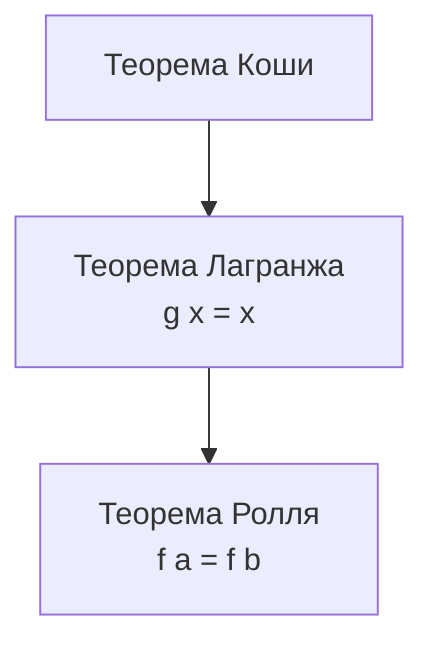

# Вопрос 3. Теоремы Ролля, Лагранжа и Коши о конечных приращениях

← [[00-MOC-Aspirantura-Prep]] · Предыдущий: [[02-Непрерывные-функции]] · Программа: [[Вопросы программы вступительного экзамена в аспирантуру по специальности 1.2.2. Математическое моделирование, численные методы и комплексы программ#^q3]]

---

## Краткий ответ (для устного экзамена)

> [!abstract] Простыми словами — вся суть
> - **Ролль:** если на отрезке функция «начинается и заканчивается на одной высоте» ($f(a) = f(b)$) и гладкая внутри — где-то **горизонтальная касательная** ($f'(c) = 0$).
> - **Лагранж:** на отрезке **средняя скорость изменения** ($\dfrac{f(b)-f(a)}{b-a}$) где-то совпадает с **мгновенной скоростью** ($f'(c)$).
> - **Коши (обобщённая):** то же для **двух** функций $f$ и $g$ — отношение приращений равно отношению производных в некоторой точке.

**Формулировки (учебник):**

- **Ролль:** $f \in C[a,b]$, $f \in D(a,b)$, $f(a) = f(b)$ $\Rightarrow$ $\exists\ c \in (a,b):\ f'(c) = 0$.
- **Лагранж:** $f \in C[a,b]$, $f \in D(a,b)$ $\Rightarrow$ $\exists\ c \in (a,b):\ f'(c) = \dfrac{f(b) - f(a)}{b - a}$.
- **Коши:** $f, g \in C[a,b]$, $f, g \in D(a,b)$, $g'(x) \ne 0$ на $(a,b)$ $\Rightarrow$ $\exists\ c \in (a,b):\ \dfrac{f(b)-f(a)}{g(b)-g(a)} = \dfrac{f'(c)}{g'(c)}$.

---

## 1. Что нужно знать перед теоремами

### Производная (напоминание)

**Формулировка (учебник):**

$$
f'(x_0) = \lim_{h \to 0} \frac{f(x_0 + h) - f(x_0)}{h}.
$$

> [!tip] Простыми словами
> Производная — **мгновенная скорость изменения** функции в точке. Геометрически — **угловой коэффициент касательной** к графику.

---

### Обозначения (важно для формулировок)

| Запись | Смысл |
|--------|-------|
| $f \in C[a,b]$ | $f$ **непрерывна** на $[a,b]$ |
| $f \in D(a,b)$ | $f$ **дифференцируема** на $(a,b)$ |
| $f'(c)$ | производная в **внутренней** точке $c \in (a,b)$ |

> [!tip] Простыми словами
> На **концах** отрезка нужна **непрерывность**, внутри — **гладкость** (производная существует). Точка $c$ ищется **строго между** $a$ и $b$.

---

## 2. Теорема Ролля

### Формулировка

**Формулировка (учебник):** пусть $f$:
1. непрерывна на $[a,b]$;
2. дифференцируема на $(a,b)$;
3. $f(a) = f(b)$.

Тогда $\exists\ c \in (a,b):\ f'(c) = 0$.

> [!tip] Простыми словами
> Если график **начинается и заканчивается на одной высоте**, то где-то внутри отрезка есть **горизонтальная касательная** — точка локального max или min (или «плато»).
>
> **Аналогия:** мяч подбросили и поймали на той же высоте — в какой-то момент скорость по вертикали была нулевой.

### Геометрический смысл

На графике $y = f(x)$ найдётся точка $c$, где касательная **параллельна оси $Ox$**.

### Когда теорема **не** работает (контрпримеры)

| Нарушено условие | Пример | Что происходит |
|------------------|--------|----------------|
| $f(a) \ne f(b)$ | $f(x) = x$ на $[0,1]$ | $f' = 1 \ne 0$ всюду |
| Нет производной внутри | $|x|$ на $[-1,1]$, $f(-1)=f(1)$ | «угол» в 0, $f'$ не существует |
| Нет непрерывности на $[a,b]$ | разрыв на отрезке | точка $c$ может не найтись |

---

## 3. Теорема Лагранжа (о конечном приращении)

### Формулировка

**Формулировка (учебник):** пусть $f \in C[a,b]$ и $f \in D(a,b)$. Тогда $\exists\ c \in (a,b)$:

$$
f'(c) = \frac{f(b) - f(a)}{b - a}.
$$

> [!tip] Простыми словами
> **Средняя скорость** на всём отрезке (наклон хорды от $(a, f(a))$ до $(b, f(b))$) **где-то совпадает** с **мгновенной скоростью** (наклоном касательной).
>
> **Аналогия:** проехали 300 км за 3 часа — средняя скорость 100 км/ч. Где-то на пути спидометр **точно** показывал 100 км/ч (если скорость менялась непрерывно и гладко).

### Эквивалентная форма (формула конечных приращений)

$$
f(b) - f(a) = f'(c)(b - a).
$$

> [!tip] Простыми словами
> Приращение функции = производная в некоторой внутренней точке × длина отрезка.

### Связь с теоремой Ролля

**Формулировка (учебник):** теорема Лагранжа **обобщает** теорему Ролля.

> [!tip] Простыми словами
> Если $f(a) = f(b)$, то $\dfrac{f(b)-f(a)}{b-a} = 0$, и из теоремы Лагранжа следует $f'(c) = 0$ — это и есть Ролля.
> Наоборот: теорема Лагранжа доказывается через **вспомогательную функцию** и теорему Ролля.

**Идея доказательства Лагранжа через Ролля:**

Положим $\varphi(x) = f(x) - \dfrac{f(b)-f(a)}{b-a}\,(x - a)$.

Тогда $\varphi(a) = \varphi(b)$, $\varphi \in C[a,b]$, $\varphi \in D(a,b)$ → по Роллю $\exists\ c:\ \varphi'(c) = 0$, откуда $f'(c) = \dfrac{f(b)-f(a)}{b-a}$.

---

## 4. Теорема Коши (обобщённая теорема о конечном приращении)

### Формулировка

**Формулировка (учебник):** пусть $f, g \in C[a,b]$, $f, g \in D(a,b)$ и $g'(x) \ne 0$ для всех $x \in (a,b)$. Тогда $\exists\ c \in (a,b)$:

$$
\frac{f(b) - f(a)}{g(b) - g(a)} = \frac{f'(c)}{g'(c)}.
$$

> [!tip] Простыми словами
> Отношение **приращений** двух функций на отрезке равно отношению их **производных** в некоторой внутренней точке.
>
> **Частный случай:** если $g(x) = x$, то $g(b)-g(a) = b-a$, $g'(c) = 1$ — получаем **теорему Лагранжа**.

### Геометрический смысл (параметрическая кривая)

Если рассматривать кривую $(g(t), f(t))$, $t \in [a,b]$, то теорема Коши утверждает: найдётся точка, где **наклон касательной** к кривой совпадает с наклоном **хорды**, соединяющей концы.

### Условие $g'(x) \ne 0$

**Зачем:** чтобы $g(b) \ne g(a)$ (иначе знаменатель обратился бы в ноль) и чтобы можно было делить на $g'(c)$.

---

## 5. Сравнение трёх теорем

| Теорема | Условия | Заключение | Смысл |
|---------|---------|------------|-------|
| **Ролль** | $f \in C[a,b]$, $f \in D(a,b)$, $f(a)=f(b)$ | $f'(c) = 0$ | Горизонтальная касательная |
| **Лагранж** | $f \in C[a,b]$, $f \in D(a,b)$ | $f'(c) = \dfrac{f(b)-f(a)}{b-a}$ | Касательная ∥ хорде |
| **Коши** | $f,g \in C[a,b]$, $f,g \in D(a,b)$, $g' \ne 0$ | $\dfrac{f(b)-f(a)}{g(b)-g(a)} = \dfrac{f'(c)}{g'(c)}$ | Обобщение для двух функций |

---

## 6. Важные следствия (часто спрашивают)

### 6.1. Если $f'(x) = 0$ на интервале — функция постоянна

**Формулировка (учебник):** если $f \in D(a,b)$ и $f'(x) = 0$ для всех $x \in (a,b)$, то $f(x) = \mathrm{const}$ на $(a,b)$.

> [!tip] Простыми словами
> Нет «наклона» нигде → функция **не меняется**.

**Доказательство (идея):** для любых $x_1, x_2 \in (a,b)$ по теореме Лагранжа $f(x_2) - f(x_1) = f'(c)(x_2 - x_1) = 0$.

---

### 6.2. Монотонность

**Формулировка (учебник):**
- $f'(x) > 0$ на $(a,b)$ $\Rightarrow$ $f$ **строго возрастает** на $[a,b]$;
- $f'(x) < 0$ на $(a,b)$ $\Rightarrow$ $f$ **строго убывает** на $[a,b]$.

> [!tip] Простыми словами
> Производная положительна → функция растёт; отрицательна → падает.

---

### 6.3. Оценка приращения (неравенство Лагранжа)

**Формулировка (учебник):** если $|f'(x)| \le M$ на $[a,b]$, то $|f(b) - f(a)| \le M|b - a|$.

> [!tip] Простыми словами
> Функция **не может измениться больше**, чем «максимальная скорость × время».

**Применение:** доказательства непрерывности, оценки погрешности, **липшицевость**.

---

## 7. Примеры

### Пример 1. Проверка теоремы Ролля: $f(x) = x^2 - 4x + 3$ на $[1, 3]$

$f(1) = 0$, $f(3) = 0$. $f'(x) = 2x - 4$. Из $f'(c) = 0$ → $c = 2 \in (1, 3)$. ✓

> [!tip] Простыми словами
> Парабола на концах отрезка на «нулевой высоте» — в вершине ($x = 2$) касательная горизонтальна.

---

### Пример 2. Теорема Лагранжа: $f(x) = \ln x$ на $[1, e]$

$$
f'(c) = \frac{1}{c} = \frac{\ln e - \ln 1}{e - 1} = \frac{1}{e - 1} \Rightarrow c = e - 1 \in (1, e).
$$

---

### Пример 3. Теорема Коши: $f(x) = x^2$, $g(x) = x^3$ на $[0, 1]$

$$
\frac{f(1)-f(0)}{g(1)-g(0)} = \frac{1}{1} = 1.
\qquad
\frac{f'(c)}{g'(c)} = \frac{2c}{3c^2} = \frac{2}{3c}.
$$

Из $2/(3c) = 1$ → $c = 2/3 \in (0, 1)$. ✓

---

### Пример 4. Контрпример для Ролля: $f(x) = |x|$ на $[-1, 1]$

$f(-1) = f(1) = 1$, но $f'(0)$ **не существует** → условие дифференцируемости нарушено, $c$ с $f'(c)=0$ **может не быть** (здесь $f'(x) = \pm 1$ при $x \ne 0$).

---

## 8. Типичные ошибки на экзамене

> [!failure] Частые ошибки
> 1. Забывают условие **$f \in C[a,b]$** (непрерывность на **замкнутом** отрезке).
> 2. Путают точку $c$ — она в **открытом** интервале $(a,b)$, не обязательно в середине.
> 3. Считают, что $c$ **единственна** — может быть несколько точек с нужной производной.
> 4. Применяют Ролля без условия **$f(a) = f(b)$**.
> 5. В теореме Коши забывают **$g'(x) \ne 0$** или что $g(b) \ne g(a)$.
> 6. Путают **теорему Лагранжа** (существование $c$) с **приближением** $f(b) \approx f(a) + f'(a)(b-a)$ (это уже формула Тейлора 1-го порядка).

---

## 9. Связь с другими темами

> [!tip] Простыми словами
> - **[[02-Непрерывные-функции|Вопрос 2]]** — непрерывность на $[a,b]$ — обязательное условие всех трёх теорем.
> - **[[04-Формула-Тейлора|Вопрос 4]]** — формула Тейлора с остатком в форме **Лагранжа** выводится из теоремы Лагранжа.
> - **[[17-Экстремум-одной-переменной|Вопрос 17]]** — теорема Ролля — ключ к доказательству **необходимого условия экстремума** ($f'(x_0) = 0$).
> - **Численные методы:** оценка $|f(b)-f(a)| \le M|b-a|$ — основа **устойчивости** и **липшицевых** оценок в задачах Коши (вопрос 40).

---

## 10. Контрольные вопросы

- [ ] Сформулируйте теорему **Ролля** (условия + заключение) **и объясните своими словами**.
- [ ] Сформулируйте теорему **Лагранжа**. Что означает $\dfrac{f(b)-f(a)}{b-a}$?
- [ ] Сформулируйте теорему **Коши**. Как из неё получить теорему Лагранжа?
- [ ] Нарисуйте (или опишите) **геометрический смысл** теоремы Лагранжа.
- [ ] Приведите **контрпример**, когда Ролля не работает.
- [ ] Докажите: если $f'(x) = 0$ на интервале, то $f = \mathrm{const}$.
- [ ] Найдите $c$ для $f(x) = x^3$ на $[0, 2]$ по теореме Лагранжа.

---

## 11. Литература

- **Кудрявцев Л.Д.** — Курс математического анализа, т. 1: гл. «Дифференцируемость», «Теоремы о дифференцируемых функциях».
- **Фихтенгольц Г.М.** — Курс дифференциального и интегрального исчисления, т. 1: §§ 148–153.

Полный список: [[Учебно-методическое обеспечение и информационное обеспечение программы вступительного экзамена в аспирантуру по специальности]]

---

## 12. Как должен выглядеть ответ на экзамене

### Образец устного ответа

> [!example] Устно (3–5 минут)
> **Теорема Ролля.** Пусть $f$ непрерывна на $[a,b]$, дифференцируема на $(a,b)$ и $f(a) = f(b)$. Тогда существует точка $c \in (a,b)$ такая, что $f'(c) = 0$. Геометрически: если концы графика на одной высоте, где-то есть горизонтальная касательная.
>
> **Теорема Лагранжа.** Пусть $f$ непрерывна на $[a,b]$ и дифференцируема на $(a,b)$. Тогда существует $c \in (a,b)$ такое, что
> $$f'(c) = \frac{f(b) - f(a)}{b - a},$$
> или эквивалентно $f(b) - f(a) = f'(c)(b - a)$. Средняя скорость изменения на отрезке где-то совпадает с мгновенной скоростью. Теорема Ролля — частный случай, когда $f(a) = f(b)$.
>
> **Теорема Коши.** Пусть $f, g$ непрерывны на $[a,b]$, дифференцируемы на $(a,b)$ и $g'(x) \ne 0$ для всех $x \in (a,b)$. Тогда существует $c \in (a,b)$:
> $$\frac{f(b) - f(a)}{g(b) - g(a)} = \frac{f'(c)}{g'(c)}.$$
> При $g(x) = x$ получаем теорему Лагранжа. Цепочка обобщений: Коши $\Rightarrow$ Лагранж $\Rightarrow$ Ролль.
>
> **Следствие.** Если $f'(x) = 0$ на интервале, то $f(x) = \mathrm{const}$ (доказывается через теорему Лагранжа).
>
> **Пример.** $f(x) = x^3$ на $[0,2]$: $\dfrac{f(2)-f(0)}{2-0} = 4$. Из $f'(c) = 3c^2 = 4$ получаем $c = \dfrac{2}{\sqrt{3}} \in (0,2)$.
>
> **Контрпример для Ролля.** $f(x) = |x|$ на $[-1,1]$: $f(-1) = f(1)$, но в 0 производная не существует — условие дифференцируемости нарушено.

**Структура ответа (чеклист):**
1. Теорема Ролля (условия + заключение + смысл)
2. Теорема Лагранжа (условия + формула + геометрический смысл)
3. Теорема Коши (условия + формула + связь с Лагранжем)
4. Одно следствие (постоянство функции или монотонность)
5. Пример вычисления $c$ или контрпример

---

### Образец письменного ответа

> [!abstract] Письменно (структура для тетради / бланка)
>
> **1. Теорема Ролля.**
>
> *Условия:* $f \in C[a,b]$, $f \in D(a,b)$, $f(a) = f(b)$.
>
> *Заключение:* $\exists\ c \in (a,b):\ f'(c) = 0$.
>
> *Геометрический смысл:* существует точка, где касательная параллельна оси $Ox$.
>
> **2. Теорема Лагранжа (о конечном приращении).**
>
> *Условия:* $f \in C[a,b]$, $f \in D(a,b)$.
>
> *Заключение:* $\exists\ c \in (a,b)$:
> $$f'(c) = \frac{f(b) - f(a)}{b - a}, \qquad f(b) - f(a) = f'(c)(b - a).$$
>
> *Связь с Роллем:* при $f(a) = f(b)$ получаем $f'(c) = 0$.
>
> **3. Теорема Коши (обобщённая).**
>
> *Условия:* $f, g \in C[a,b]$, $f, g \in D(a,b)$, $g'(x) \ne 0$ на $(a,b)$.
>
> *Заключение:* $\exists\ c \in (a,b)$:
> $$\frac{f(b) - f(a)}{g(b) - g(a)} = \frac{f'(c)}{g'(c)}.$$
>
> *Частный случай:* $g(x) = x$ $\Rightarrow$ теорема Лагранжа.
>
> **4. Следствие.** $f'(x) = 0$ на $(a,b)$ $\Rightarrow$ $f(x) = \mathrm{const}$.
>
> **5. Пример.** $f(x) = x^3$, $[0,2]$: $f'(c) = 3c^2 = 4$ $\Rightarrow$ $c = 2/\sqrt{3} \in (0,2)$.

### Чеклист устно / письменно

| Тема | Устно | Письменно |
|------|-------|-----------|
| Ролль | Условия + смысл | Условия + $f'(c)=0$ |
| Лагранж | «средняя = мгновенная» | Формула + связь с Роллем |
| Коши | Две функции, $g(x)=x$ | $g' \ne 0$ + формула |
| Пример | Назвать $c$ | Полное вычисление |

---

**Предыдущий:** [[02-Непрерывные-функции]] · **Следующий:** [[04-Формула-Тейлора]]
