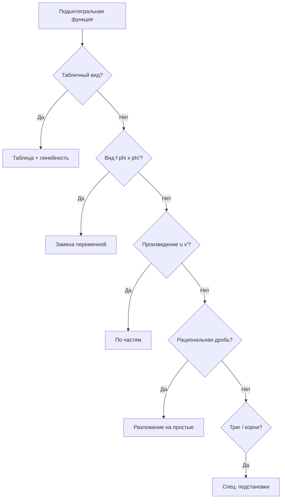

# Вопрос 6. Неопределённый и определённый интеграл. Основные приёмы интегрирования

← [[00-MOC-Aspirantura-Prep]] · Предыдущий: [[05-Интеграл-Ньютона-Лейбница]] · Следующий: [[07-Функции-многих-переменных-пределы-непрерывность]] · Программа: [[Вопросы#^q6|Вопросы]]

---

## Краткий ответ (для устного экзамена)

> [!abstract] Простыми словами — вся суть
>
> - **Таблица интегралов** — «обратные» к таблице производных; первый шаг любого вычисления.
> - **Замена переменной** — если подынтегральное выражение содержит $f(\varphi(x))\varphi'(x)$, подставляем $t = \varphi(x)$.
> - **Интегрирование по частям** — для произведения $u \cdot v'$: $\int u\,dv = uv - \int v\,du$.
> - **Рациональные дроби** — делим многочлены, разлагаем знаменатель на множители, раскладываем на простые дроби.
> - **Тригонометрия** — стандартные подстановки ($t = \tan x/2$, замены для $\sin^m x \cos^n x$ и т.д.).

**Главные формулы:**

$$
\int u\,dv = uv - \int v\,du \qquad \text{(по частям)}
$$

$$
\int f(\varphi(x))\,\varphi'(x)\,dx = \int f(t)\,dt \Big|_{t=\varphi(x)} \qquad \text{(замена } t = \varphi(x)\text{)}
$$

---

## 1. Таблица основных неопределённых интегралов

**Формулировка (учебник):** если $F'(x) = f(x)$, то $\int f(x)\,dx = F(x) + C$.

| $f(x)$                          | $\int f(x)\,dx$                                                       |
| ------------------------------- | --------------------------------------------------------------------- |
| $x^n$ ($n \ne -1$)              | $\dfrac{x^{n+1}}{n+1} + C$                                            |
| $\dfrac{1}{x}$                  | $\ln\lvert x \rvert + C$                                              |
| $e^x$                           | $e^x + C$                                                             |
| $a^x$                           | $\dfrac{a^x}{\ln a} + C$                                              |
| $\sin x$                        | $-\cos x + C$                                                         |
| $\cos x$                        | $\sin x + C$                                                          |
| $\dfrac{1}{\cos^2 x}$           | $\tan x + C$                                                          |
| $\dfrac{1}{\sin^2 x}$           | $-\cot x + C$                                                         |
| $\dfrac{1}{\sqrt{1-x^2}}$       | $\arcsin x + C$                                                       |
| $\dfrac{1}{1+x^2}$              | $\arctan x + C$                                                       |
| $\dfrac{1}{\sqrt{x^2 \pm a^2}}$ | $\ln\lvert x + \sqrt{x^2 \pm a^2} \rvert + C$                         |
| $\dfrac{1}{x^2 \pm a^2}$        | $\dfrac{1}{2a}\ln\left\lvert\dfrac{x \mp a}{x \pm a}\right\rvert + C$ |

> [!tip] Простыми словами
> Таблица — это «память» обратных операций к дифференцированию. На экзамене её часто просят воспроизвести или использовать без подсказки.

---

## 2. Линейность (напоминание)

**Формулировка (учебник):**

$$
\int (f \pm g)\,dx = \int f\,dx \pm \int g\,dx, \qquad
\int k f\,dx = k \int f\,dx.
$$

> [!tip] Простыми словами
> Константу выносим, сумму/разность интегрируем по частям. Подробнее — [[05-Интеграл-Ньютона-Лейбница|Вопрос 5]].

---

## 3. Метод замены переменной

### Неопределённый интеграл

**Формулировка (учебник):** пусть $x = \psi(t)$ дифференцируема, $f$ непрерывна. Тогда

$$
\int f(\varphi(x))\,\varphi'(x)\,dx = \int f(t)\,dt \Big|_{t=\varphi(x)}.
$$

**Алгоритм:**

1. Выбрать $t = \varphi(x)$ так, чтобы «внутренняя» функция и её производная были видны в подынтегральном выражении.
2. Выразить $dx = \dfrac{dt}{\varphi'(x)}$ и подставить.
3. Интегрировать по $t$, вернуться к $x$.

> [!tip] Простыми словами
> Если видите «функцию от чего-то» × «производную этого чего-то» — это сигнал к замене.
> Пример: $\int 2x\cos(x^2)\,dx$ — берём $t = x^2$, тогда $dt = 2x\,dx$.

---

### Определённый интеграл

**Формулировка (учебник):** при замене $x = \psi(t)$, $a = \psi(\alpha)$, $b = \psi(\beta)$:

$$
\int_a^b f(x)\,dx = \int_\alpha^\beta f(\psi(t))\,\psi'(t)\,dt.
$$

> [!important] На экзамене
> В **определённом** интеграле **обязательно меняют пределы** — не нужно возвращаться к $x$, если пределы уже пересчитаны.

---

### Пример 1. $\int x e^{x^2}\,dx$

$t = x^2$, $dt = 2x\,dx$:

$$
\int x e^{x^2}\,dx = \frac{1}{2}\int e^t\,dt = \frac{1}{2}e^t + C = \frac{1}{2}e^{x^2} + C.
$$

---

### Пример 2. $\int_0^1 \dfrac{x}{\sqrt{1+x^2}}\,dx$

$t = 1 + x^2$, $dt = 2x\,dx$, при $x=0$: $t=1$; при $x=1$: $t=2$:

$$
\int_0^1 \frac{x}{\sqrt{1+x^2}}\,dx = \frac{1}{2}\int_1^2 t^{-1/2}\,dt = \left.\sqrt{t}\,\right|_1^2 = \sqrt{2} - 1.
$$

---

## 4. Интегрирование по частям

### Формула

**Формулировка (учебник):** если $u = u(x)$, $v = v(x)$ дифференцируемы, то

$$
\int u\,dv = uv - \int v\,du.
$$

Эквивалентная запись: $\int u(x)v'(x)\,dx = u(x)v(x) - \int v(x)u'(x)\,dx$.

> [!tip] Простыми словами
> Берём произведение двух «факторов». Один ($u$) дифференцируем, другой ($dv$) интегрируем. Получаем более простой интеграл $\int v\,du$.
>
> **Правило LIATE** (порядок выбора $u$): **L**og, **I**nverse trig, **A**lgebraic, **T**rig, **E**xponential — $u$ выбирают «левее» в списке.

---

### Пример 3. $\int x e^x\,dx$

$u = x$, $dv = e^x dx$ $\Rightarrow$ $du = dx$, $v = e^x$:

$$
\int x e^x\,dx = x e^x - \int e^x\,dx = e^x(x - 1) + C.
$$

---

### Пример 4. $\int \ln x\,dx$

$u = \ln x$, $dv = dx$ $\Rightarrow$ $du = \dfrac{dx}{x}$, $v = x$:

$$
\int \ln x\,dx = x\ln x - \int x \cdot \frac{1}{x}\,dx = x\ln x - x + C.
$$

---

### Пример 5. $\int x^2 \sin x\,dx$ (дважды по частям)

Первый раз: $u = x^2$, $dv = \sin x\,dx$ → $\int x\cos x\,dx$; второй раз по частям → итог:

$$
\int x^2 \sin x\,dx = -x^2\cos x + 2x\sin x + 2\cos x + C.
$$

---

## 5. Интегрирование рациональных функций

### Вид

**Формулировка (учебник):** рациональная функция — отношение многочленов $R(x) = P(x)/Q(x)$.

**Алгоритм:**

1. Если $\deg P \ge \deg Q$ — **деление многочленов** (получаем многочлен + proper fraction).
2. Разложить $Q(x)$ на **неприводимые множители** над $\mathbb{R}$.
3. Разложить дробь на **простые** (метод неопределённых коэффициентов).
4. Интегрировать каждое слагаемое по таблице.

---

### Простые дроби (знаменатель без кратных корней)

| Знаменатель               | Вид слагаемого                 |
| ------------------------- | ------------------------------ |
| $(x - a)$                 | $\dfrac{A}{x - a}$             |
| $(x^2 + px + q)$, $q > 0$ | $\dfrac{Ax + B}{x^2 + px + q}$ |

> [!tip] Простыми словами
> «Разбираем сложную дробь на простые кирпичики», каждый из которых интегрируется по таблице или заменой.

---

### Пример 6. $\int \dfrac{1}{x^2 - 1}\,dx$

$$
\frac{1}{x^2 - 1} = \frac{1}{2}\left(\frac{1}{x-1} - \frac{1}{x+1}\right),
$$

$$
\int \frac{dx}{x^2 - 1} = \frac{1}{2}\ln\left\lvert\frac{x-1}{x+1}\right\rvert + C.
$$

---

### Пример 7. $\int \dfrac{2x + 3}{x^2 + x}\,dx$

$x^2 + x = x(x+1)$. Разложение: $\dfrac{2x+3}{x(x+1)} = \dfrac{3}{x} - \dfrac{1}{x+1}$:

$$
\int \frac{2x+3}{x^2+x}\,dx = 3\ln\lvert x \rvert - \ln\lvert x+1 \rvert + C.
$$

---

## 6. Тригонометрические интегралы

### Типы и приёмы

| Вид                                               | Приём                                                                                   |
| ------------------------------------------------- | --------------------------------------------------------------------------------------- |
| $\int \sin^m x \cos^n x\,dx$, $m$ или $n$ нечётно | Выделить одну степень, замена $t = \sin x$ или $t = \cos x$                             |
| $\int \sin^m x \cos^n x\,dx$, $m,n$ чётны         | Понижение степени: $\sin^2 x = \dfrac{1-\cos 2x}{2}$, $\cos^2 x = \dfrac{1+\cos 2x}{2}$ |
| $\int R(\sin x, \cos x)\,dx$                      | Универсальная подстановка $t = \tan\dfrac{x}{2}$                                        |
| $\int \dfrac{dx}{a\sin x + b\cos x + c}$          | Специальные подстановки (зависят от вида)                                               |

---

### Пример 8. $\int \sin^3 x\,dx$

$$
\int \sin^3 x\,dx = \int \sin^2 x \cdot \sin x\,dx = \int (1 - \cos^2 x)(-\,d(\cos x)) = -\cos x + \frac{\cos^3 x}{3} + C.
$$

---

### Пример 9. $\int \cos^2 x\,dx$

$$
\int \cos^2 x\,dx = \int \frac{1 + \cos 2x}{2}\,dx = \frac{x}{2} + \frac{\sin 2x}{4} + C.
$$

---

## 7. Интегралы с иррациональностями

**Типичные замены:**

| Подынтегральное выражение | Замена                          |
| ------------------------- | ------------------------------- |
| $\sqrt[n]{ax + b}$        | $t = \sqrt[n]{ax + b}$          |
| $\sqrt{a^2 - x^2}$        | $x = a\sin t$ или $x = a\cos t$ |
| $\sqrt{x^2 + a^2}$        | $x = a\tan t$ или $x = a\sh t$  |
| $\sqrt{x^2 - a^2}$        | $x = \dfrac{a}{\cos t}$         |

> [!tip] Простыми словами
> Тригонометрические подстановки «убирают корень» за счёт тождества $\sin^2 t + \cos^2 t = 1$.

---

### Пример 10. $\int \dfrac{dx}{\sqrt{1 - x^2}}$

$x = \sin t$, $dx = \cos t\,dt$, $\sqrt{1-x^2} = \cos t$:

$$
\int \frac{dx}{\sqrt{1-x^2}} = \int dt = t + C = \arcsin x + C.
$$

---

## 8. Общая стратегия выбора метода

> [!tip] Простыми словами
> Идём от простого к сложному: таблица → замена → по частям → рациональные → тригонометрия.

---

## 9. Типичные ошибки на экзамене

> [!failure] Частые ошибки
>
> 1. Забывать **$+C$** в неопределённом интеграле.
> 2. В определённом интеграле при замене **не менять пределы** или менять их неправильно.
> 3. Неверный выбор $u$ и $dv$ в интегрировании по частям — интеграл становится **сложнее**, а не проще.
> 4. Ошибки при разложении на простые дроби (неверные коэффициенты).
> 5. Забывать модуль в $\ln\lvert x \rvert$ при $\int dx/x$.
> 6. Путать $\int \tan x\,dx = -\ln\lvert\cos x \rvert + C$ и $\int \cot x\,dx = \ln\lvert\sin x \rvert + C$.

---

## 10. Связь с другими темами

> [!tip] Простыми словами
>
> - **[[05-Интеграл-Ньютона-Лейбница|Вопрос 5]]** — определения и формула Ньютона–Лейбница; приёмы дают **первообразную**.
> - **[[04-Формула-Тейлора|Вопрос 4]]** — замена и по частям — те же идеи, что в доказательствах (выделение множителя-производной).
> - **Численные методы (вопросы 38–46)** — если первообразную не найти аналитически, используют квадратурные формулы.

---

## 11. Контрольные вопросы

- [ ] Назовите основные табличные интегралы (степенная, $1/x$, экспонента, sin/cos, $1/(1+x^2)$).
- [ ] Сформулируйте формулу интегрирования по частям.
- [ ] Вычислите $\int x\cos x\,dx$ и $\int x^2 e^x\,dx$.
- [ ] Вычислите $\int \dfrac{dx}{x^2 - 4}$ через простые дроби.
- [ ] Вычислите $\int_0^{\pi/2} \sin^2 x\,dx$.
- [ ] Когда в определённом интеграле меняют пределы при замене?

---

## 12. Литература

- **Кудрявцев Л.Д.** — Курс математического анализа, т. 1: гл. «Методы интегрирования».
- **Фихтенгольц Г.М.** — Курс дифференциального и интегрального исчисления, т. 1: §§ 181–213.

Полный список: [[Учебно-методическое обеспечение и информационное обеспечение программы вступительного экзамена в аспирантуру по специальности]]

---

## 13. Как должен выглядеть ответ на экзамене

### Образец устного ответа

> [!example] Устно (3–5 минут)
> **Основные приёмы интегрирования** — способы найти первообразную, когда табличная формула не подходит напрямую.
>
> **1. Таблица интегралов** — обратные к таблице производных: степенная, $1/x$, экспонента, тригонометрия, $\arcsin$, $\arctan$.
>
> **2. Замена переменной:** если подынтегральное выражение имеет вид $f(\varphi(x))\varphi'(x)$, полагаем $t = \varphi(x)$. В определённом интеграле меняем и **пределы**.
>
> **3. По частям:** $\int u\,dv = uv - \int v\,du$. Применяем к произведениям (многочлен × exp/sin/cos, $\ln x$ и т.д.).
>
> **4. Рациональные функции:** деление многочленов, разложение знаменателя, разложение на простые дроби.
>
> **5. Тригонометрия:** понижение степени, замена при нечётной степени, универсальная подстановка $t = \tan(x/2)$.
>
> **Пример:** $\int x e^x\,dx = x e^x - e^x + C$ (по частям, $u = x$, $dv = e^x dx$).

---

### Образец письменного ответа

> [!abstract] Письменно (структура для тетради / бланка)
>
> **1. Таблица.** $\int x^n dx = \dfrac{x^{n+1}}{n+1} + C$ ($n \ne -1$), $\int \dfrac{dx}{x} = \ln\lvert x \rvert + C$, $\int e^x dx = e^x + C$, $\int \sin x\,dx = -\cos x + C$, $\int \dfrac{dx}{1+x^2} = \arctan x + C$, …
>
> **2. Замена.** $t = \varphi(x)$, $dt = \varphi'(x)\,dx$:
> $$\int f(\varphi(x))\varphi'(x)\,dx = \int f(t)\,dt.$$
> Определённый: $\int_a^b f(x)\,dx = \int_\alpha^\beta f(\psi(t))\psi'(t)\,dt$.
>
> **3. По частям.**
> $$\int u\,dv = uv - \int v\,du.$$
>
> **4. Рациональные дроби.** $\dfrac{P}{Q}$, $\deg P < \deg Q$; разложение $Q$ и дроби на простые слагаемые.
>
> **5. Пример.** $\int \dfrac{dx}{x^2-1} = \dfrac{1}{2}\ln\left\lvert\dfrac{x-1}{x+1}\right\rvert + C$.

---

### Чеклист устно / письменно

| Тема         | Устно                        | Письменно                          |
| ------------ | ---------------------------- | ---------------------------------- |
| Таблица      | 5–7 основных формул          | Полная таблица или ключевые строки |
| Замена       | Условие $f(\varphi)\varphi'$ | Формула + смена пределов           |
| По частям    | Формула + LIATE              | Формула + один пример              |
| Рациональные | Алгоритм в 3 шага            | Разложение + интеграл              |
| Пример       | $\int x e^x\,dx$             | Полное вычисление                  |

---

**Предыдущий:** [[05-Интеграл-Ньютона-Лейбница]] · **Следующий:** [[07-Функции-многих-переменных-пределы-непрерывность]]
