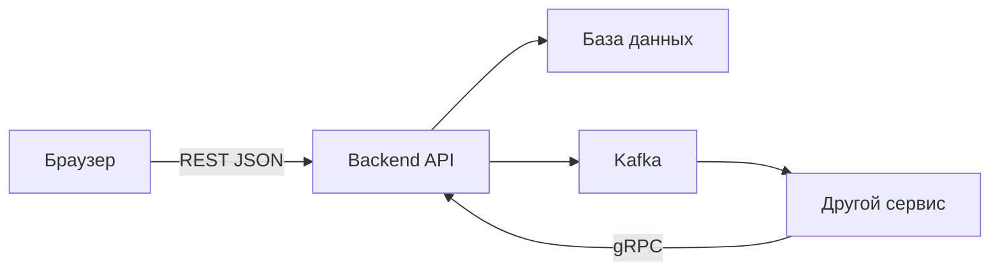

# Глоссарий: фронтенд → бэкенд

← [[00-MOC-Backend-Review]]

Для тех, кто переходит с фронта. Каждый термин — **что это** + **аналогия с фронта** + **ссылка на тему**.

> [!tip] Как пользоваться
> Не зубрите всё сразу. На фазе 0 достаточно блоков «Базовые», «Go» и «HTTP». Остальное — по мере прохождения MOC.

---

## Главная идея

| Фронт | Бэк |
|-------|-----|
| UI в браузере | Сервер, который принимает запросы |
| `fetch('/api/notes')` | Handler, который отвечает на `/api/notes` |
| `useState`, локальный state | Данные в БД, не в памяти процесса |
| Sentry, DevTools | Логи, метрики, health checks |
| npm, Vite | `go mod`, Docker, K8s |

**Фронт — витрина. Бэк — кухня + склад + касса.**

---

## Базовые термины

| Термин | Простыми словами | Аналогия с фронта | Тема |
|--------|------------------|-------------------|------|
| **API** | Набор эндпоинтов для клиентов | URL, к которым вы делаете `fetch` | [[02-HTTP-REST-chi-Junior]] |
| **Endpoint** | URL + метод, напр. `GET /notes` | `fetch('/api/notes', { method: 'GET' })` | [[02-HTTP-REST-chi-Junior]] |
| **REST** | Стиль API: ресурсы + HTTP-методы | То, что вы уже используете | [[02-HTTP-REST-chi-Junior]] |
| **Request** | Входящий запрос (метод, URL, тело) | Аргументы `fetch` | [[02-HTTP-REST-chi-Junior]] |
| **Response** | Ответ (код, заголовки, тело) | `Response` из `fetch` | [[02-HTTP-REST-chi-Junior]] |
| **Handler** | Функция, обрабатывающая запрос | Route handler в Next.js API routes | [[02-HTTP-REST-chi-Junior]] |
| **Middleware** | Прослойка до/после handler | Interceptor в axios, middleware в Express | [[02-HTTP-REST-chi-Junior]] |
| **Validation** | Проверка входных данных | Валидация формы, но **обязательно на сервере** | [[02-HTTP-REST-chi-Junior]] |
| **CORS** | Может ли браузер читать ответ с другого origin | CORS-ошибка в DevTools | [[02-HTTP-REST-chi-Junior]] |
| **Stateless** | Сервер не хранит state между запросами в памяти | Не как `useState` — данные в БД/токене | [[06-Архитектура-Junior]] |
| **CRUD** | Create, Read, Update, Delete | Те же операции, что в UI | [[02-HTTP-REST-chi-Junior]] |
| **Idempotent** | Повтор запроса не ломает систему | GET можно обновить страницу; POST — нет | [[02-HTTP-REST-chi-Junior]] |

---

## HTTP-коды (шпаргалка)

| Код | Смысл | Когда на бэке |
|-----|-------|---------------|
| `200` | OK | Успешный GET/PUT |
| `201` | Created | Успешный POST |
| `204` | No Content | Успешный DELETE без тела |
| `400` | Bad Request | Невалидный JSON, пустой title |
| `404` | Not Found | Заметка не найдена |
| `500` | Internal Server Error | Неожиданная ошибка сервера |

---

## Слои бэкенда

| Слой | Что делает | Аналогия с фронта | Тема |
|------|------------|-------------------|------|
| **API** | Принять запрос, вернуть ответ | Компонент страницы — только UI и вызов сервиса | [[06-Архитектура-Junior]] |
| **Processor** | Бизнес-логика, оркестрация | Custom hook / service layer | [[06-Архитектура-Junior]] |
| **Domain** | Модели, инварианты, правила | TypeScript types + domain rules | [[06-Архитектура-Junior]] |
| **Storage** | Только SQL/CRUD | Не UI и не бизнес — только «сохранить/прочитать» | [[04-MySQL-database-sql-Junior]] |
| **Integrations** | Kafka, Vault, внешние API | `apiClient` для внешних систем | [[05-Kafka-Messaging-Junior]] |

> [!warning] Правило Junior
> SQL не живёт в HTTP handler. Как JSX не должен содержать SQL.

---

## Go — термины

| Термин        | Простыми словами                       | Аналогия с фронта                                       | Тема                      |
| ------------- | -------------------------------------- | ------------------------------------------------------- | ------------------------- |
| **Package**   | Папка с кодом, единица импорта         | ES module / папка в monorepo                            | [[01-Go-язык-Junior]]     |
| **Struct**    | Объект с полями                        | `interface` / `type` в TypeScript                       | [[01-Go-язык-Junior]]     |
| **Pointer**   | Ссылка на значение (`&`, `*`)          | Передача по ссылке, мутация объекта                     | [[01-Go-язык-Junior]]     |
| **Interface** | Контракт методов                       | TypeScript interface (но реализация неявная)            | [[01-Go-язык-Junior]]     |
| **Error**     | Возвращаемое значение, не exception    | Не `try/catch`, а `if (err) return err`                 | [[01-Go-язык-Junior]]     |
| **Goroutine** | Легковесный фоновый поток              | `setTimeout` / Worker, но встроено в язык               | [[01-Go-язык-Junior]]     |
| **Channel**   | Канал связи между goroutine            | Message channel в Worker API                            | [[01-Go-язык-Junior]]     |
| **Context**   | Отмена, таймаут, request-scoped данные | `AbortController` + передача signal вниз                | [[01-Go-язык-Junior]]     |
| **defer**     | Выполнить при выходе из функции        | `finally` без try/catch                                 | [[01-Go-язык-Junior]]     |
| **DI**        | Зависимости через конструктор          | Передать `apiClient` в hook, не импортировать глобально | [[06-Архитектура-Junior]] |

---

## База данных

| Термин | Простыми словами | Аналогия с фронта | Тема |
|--------|------------------|-------------------|------|
| **DB / Database** | Постоянное хранилище | Не `localStorage` — отдельный сервер | [[04-MySQL-database-sql-Junior]] |
| **Table** | Таблица сущностей | Массив объектов, но на диске | [[04-MySQL-database-sql-Junior]] |
| **Row** | Одна запись | Один элемент массива | [[04-MySQL-database-sql-Junior]] |
| **Column** | Поле записи | Ключ объекта: `title`, `id` | [[04-MySQL-database-sql-Junior]] |
| **SQL** | Язык запросов к БД | Нет прямого аналога на фронте | [[04-MySQL-database-sql-Junior]] |
| **Transaction** | «Всё или ничего» | Как batch update — либо все, либо откат | [[04-MySQL-database-sql-Junior]] |
| **Rollback** | Отмена транзакции | `git revert` для БД | [[04-MySQL-database-sql-Junior]] |
| **Migration** | Версионное изменение схемы | Как миграции Prisma/Drizzle | [[04-MySQL-database-sql-Junior]] |
| **Connection pool** | Пул готовых соединений с БД | Connection pooling в HTTP-клиенте | [[04-MySQL-database-sql-Junior]] |
| **SQL injection** | Взлом через склеенный SQL | Как XSS, но для БД | [[04-MySQL-database-sql-Junior]] |

---

## gRPC и Kafka

| Термин | Простыми словами | Аналогия с фронта | Тема |
|--------|------------------|-------------------|------|
| **gRPC** | Общение сервис ↔ сервис | Не для браузера — для бэкендов | [[03-gRPC-Junior]] |
| **Protobuf** | Контракт данных `.proto` | TypeScript types между сервисами | [[03-gRPC-Junior]] |
| **Unary RPC** | Один запрос → один ответ | Обычный `fetch`, но между серверами | [[03-gRPC-Junior]] |
| **Event / Message** | Сообщение «что-то произошло» | Custom event, но между сервисами | [[05-Kafka-Messaging-Junior]] |
| **Topic** | Категория событий | Канал подписки | [[05-Kafka-Messaging-Junior]] |
| **Producer** | Отправляет события | `dispatch(action)` | [[05-Kafka-Messaging-Junior]] |
| **Consumer** | Читает и обрабатывает | `subscribe(callback)` | [[05-Kafka-Messaging-Junior]] |
| **At-least-once** | Сообщение может прийти дважды | Нужна идемпотентность обработчика | [[05-Kafka-Messaging-Junior]] |
| **Outbox** | Сначала БД, потом Kafka через воркер | Надёжная доставка, не dual-write | [[05-Kafka-Messaging-Junior]] |
| **DLQ** | Очередь «битых» сообщений | Dead letter — разобрать вручную | [[05-Kafka-Messaging-Junior]] |

**Правило:** браузеру — REST. Внутри кластера — часто gRPC и Kafka.

---

## Observability и инфра

| Термин | Простыми словами | Аналогия с фронта | Тема |
|--------|------------------|-------------------|------|
| **Structured logging** | Логи с полями, не plain text | `console.log({ requestId, userId })` | [[07-Observability-Junior]] |
| **Metrics** | Цифры: RPS, latency, errors | Web Vitals, но для сервера | [[07-Observability-Junior]] |
| **Health check** | «Сервер жив?» | Ping / heartbeat | [[07-Observability-Junior]] |
| **Readiness** | «Готов принимать трафик?» | App mounted + data loaded | [[07-Observability-Junior]] |
| **Graceful shutdown** | Дождаться текущих запросов при остановке | Cleanup в `useEffect` return | [[02-HTTP-REST-chi-Junior]] |
| **Docker** | Контейнер с приложением | Сборка prod-бандла, но для сервера | [[08-Инструменты-окружение-Junior]] |
| **K8s / Pod** | Несколько копий сервиса в проде | Не один инстанс — 2–3 реплики | [[08-Инструменты-окружение-Junior]] |
| **ENV** | Настройки через переменные окружения | `.env` / `import.meta.env` | [[08-Инструменты-окружение-Junior]] |

---

## Разговорная речь на бэке

| Фраза | Перевод |
|-------|---------|
| «Поднимаем сервис» | Запускаем backend-приложение |
| «Пробросить context» | Передать отмену/таймаут/request ID дальше |
| «Завернуть ошибку» | `fmt.Errorf("save note: %w", err)` |
| «Вынести в storage» | SQL только в отдельном слое |
| «Сервис stateless» | Можно 3 копии — не делят память |
| «Коммитим offset» | Consumer: «сообщение обработано» |
| «Падает readiness» | Балансировщик не шлёт трафик на pod |
| «Прогнать миграции» | Применить изменения схемы БД |

---

## Что учить на каждой фазе

| Фаза | Термины из этого глоссария |
|------|----------------------------|
| 0 (нед. 1–2) | Package, struct, error, interface, context, goroutine, channel | 
| 1 (нед. 3–4) | API, handler, middleware, REST, CRUD, status codes, CORS |
| 2 (нед. 5–6) | DB, SQL, transaction, storage, слои API/Processor/Storage |
| 3 (нед. 7–8) | gRPC, protobuf, Kafka, producer, consumer, outbox |
| 4 (нед. 9–10) | Logs, metrics, health, Docker, ENV |
| 5 (нед. 11–12) | Всё вместе в [[10-Capstone-проект]] |

---

## Связанные заметки

- [[00-Junior-Карточки-QA]] — тренировка терминов
- [[01-Go-язык-Junior]] — первая тема курса
- [[Требования к грейдам Backend Go-разработчика]] — полная матрица
