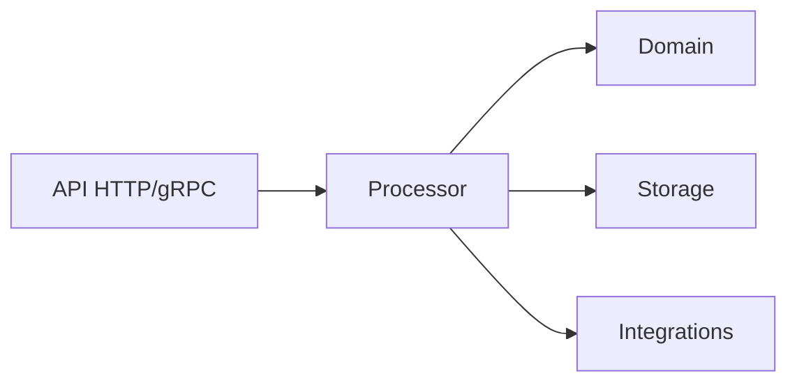

# Архитектура приложения — Junior

← [[00-MOC-Backend-Review]] · Матрица: [[Требования к грейдам Backend Go-разработчика#Архитектура приложения]]

---

## Слоистая структура



| Слой | Ответственность |
|------|-----------------|
| **API** | HTTP/gRPC handlers, парсинг запроса, маппинг ошибок в коды |
| **Processor** | Бизнес-логика, оркестрация Storage + Integrations |
| **Domain** | Модели, инварианты, доменные типы |
| **Storage** | Только SQL/CRUD |
| **Integrations** | Kafka, Vault, внешние HTTP API |

**Поток запроса:** `HTTP handler` → `Processor.CreateNote()` → `Storage.Insert()` + `Outbox.Insert()`.

---

## Dependency injection через конструкторы

```go
type NotesProcessor struct {
    storage NoteStorage
    events  EventPublisher
    log     *zap.Logger
}

func NewNotesProcessor(storage NoteStorage, events EventPublisher, log *zap.Logger) *NotesProcessor {
    return &NotesProcessor{storage: storage, events: events, log: log}
}
```

**Не использовать:** глобальные `var db *sql.DB`, `var logger *zap.Logger`.

Интерфейсы для зависимостей — для тестов и подмены реализаций:

```go
type NoteStorage interface {
    GetByID(ctx context.Context, id int64) (domain.Note, error)
    Insert(ctx context.Context, note domain.Note) error
}
```

---

## Фоновые компоненты в одном процессе

Один бинарник `cmd/notes/main.go` поднимает:
- HTTP API (goroutine)
- gRPC server (goroutine)
- Kafka consumer (goroutine)
- Outbox worker (goroutine)
- Polling workers (если есть)

```go
func main() {
    ctx, cancel := signal.NotifyContext(context.Background(), syscall.SIGINT, syscall.SIGTERM)
    defer cancel()

    // wiring: db, storage, processor, handlers
    go apiServer.ListenAndServe()
    go grpcServer.Serve(lis)
    go consumer.Run(ctx)
    go outboxWorker.Run(ctx)

    <-ctx.Done()
    // graceful shutdown
}
```

---

## Stateless

2–3 реплики в K8s — **нет shared in-memory state** между подами:
- Нет локального кэша без invalidation
- Нет in-memory locks для координации
- Состояние — в MySQL, Kafka, Redis (если есть)

Любой под может обработать любой HTTP-запрос или Kafka-сообщение.

---

## Layout проекта

```
cmd/notes/main.go
internal/
  api/http/          # chi handlers
  api/grpc/          # gRPC server
  processor/         # бизнес-логика
  domain/            # Note, ошибки домена
  storage/mysql/     # SQL
  integrations/
    kafka/           # producer, consumer
    vault/           # секреты (если нужно)
deployments/
  changelogs/        # Liquibase
  kustomize/         # K8s (Middle)
```

---

## Domain: инварианты

```go
type Note struct {
    ID     int64
    Title  string
    Status Status
}

func NewNote(title string) (Note, error) {
    if strings.TrimSpace(title) == "" {
        return Note{}, ErrEmptyTitle
    }
    return Note{Title: title, Status: StatusDraft}, nil
}
```

Валидация на границе домена — не размазана по handler и SQL.

---

## Частые ошибки

| Ошибка | Правильно |
|--------|-----------|
| SQL в handler | Storage |
| `if user.IsAdmin` в Storage | Processor / Domain |
| God-object `Service` на 2000 строк | Несколько Processor по bounded context |
| Циклические импорты | Интерфейсы в consumer-пакете или `domain` |

---

## Как проверить, что понял

- [ ] Нарисовать слои для «создать заметку + событие в outbox»
- [ ] Показать конструктор с 3 зависимостями-интерфейсами
- [ ] Объяснить, почему 3 пода не делят map в памяти

**Связанные темы:** [[02-HTTP-REST-chi-Junior]] · [[04-MySQL-database-sql-Junior]] · [[10-Capstone-проект]]
